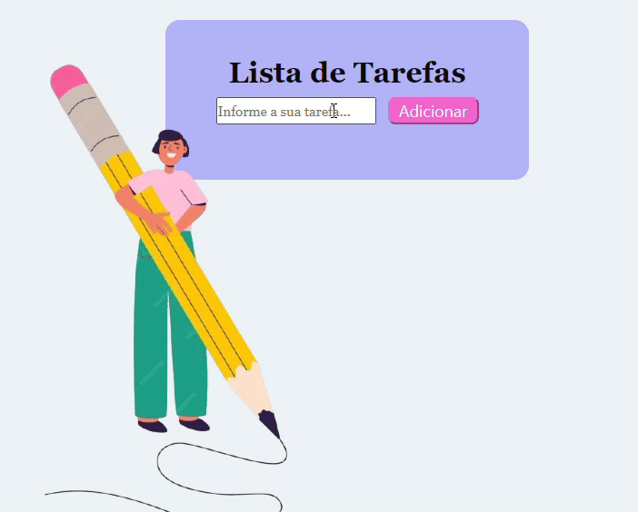

<h1>📝 Lista de Tarefas</h1>
Este projeto é uma aplicação simples de Lista de Tarefas (To-Do List) onde você pode adicionar, remover e marcar tarefas como concluídas com a ajuda de um seletor de check. ✅

<h2>🚀 Funcionalidades</h2>

➕ Adicionar Tarefas: Adicione novas tarefas à sua lista.

❌ Remover Tarefas: Remova tarefas quando não precisar mais delas.

✅ Marcar Tarefas como Concluídas: Use a c  aixa de seleção para marcar as tarefas como feitas.

🗑️ Remover Tarefas Concluídas: Remova tarefas concluídas da lista com facilidade.

<h2>👩‍💻 Como Usar</h2>

1º Adicionar uma Tarefa: 
- Digite o nome da tarefa no campo de entrada de texto.
- Clique no botão Adicionar Tarefa para adicionar a tarefa à lista.

2º Marcar uma Tarefa como Concluída: ✔️
- Clique na caixa de seleção ao lado da tarefa para marcá-la como concluída. 

3º Remover uma Tarefa: 🗑️
- Clique no botão Remover ao lado da tarefa que você deseja excluir. 

4º Remover Tarefas Concluídas: 💨
- Tarefas concluídas podem ser removidas facilmente da lista. 

<h2>💻 Tecnologias Utilizadas</h2>
HTML5 🏗️: Para estruturar a página.

CSS3 🎨: Para estilizar a aplicação.

JavaScript ⚙️: Para tornar a lista interativa.

<h2>🤝 Contribuindo</h2>

- Faça o fork deste repositório
- Crie uma nova branch

